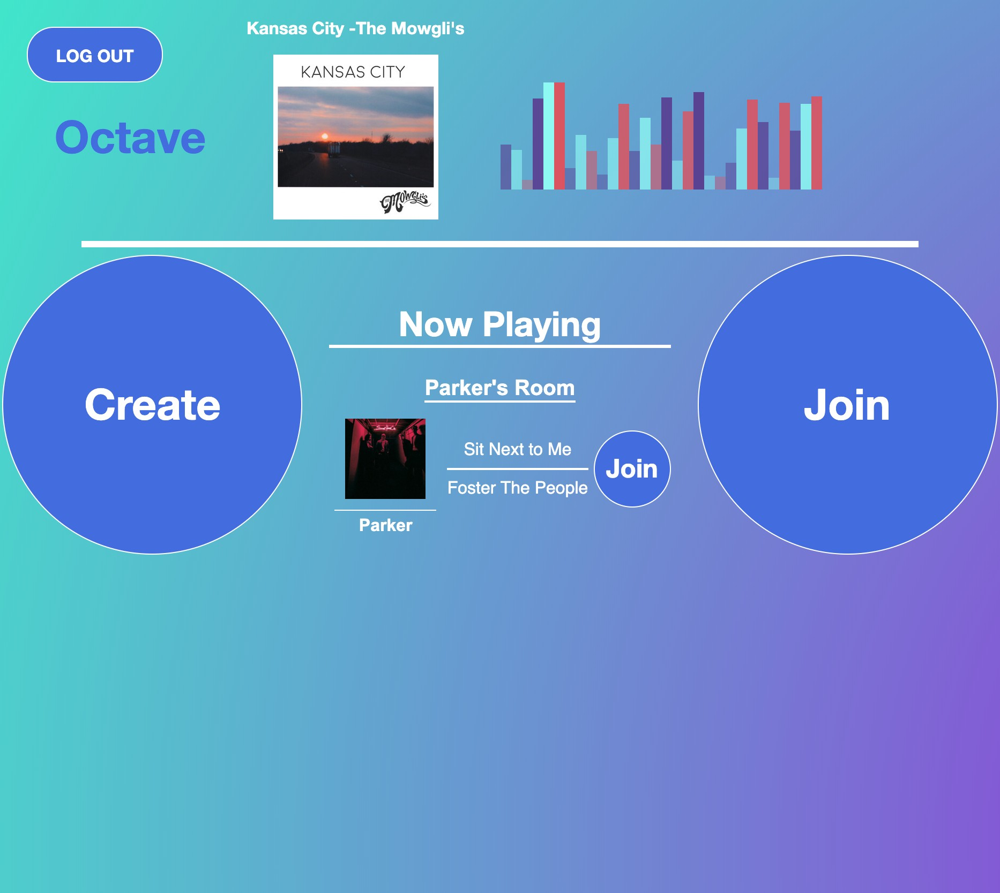
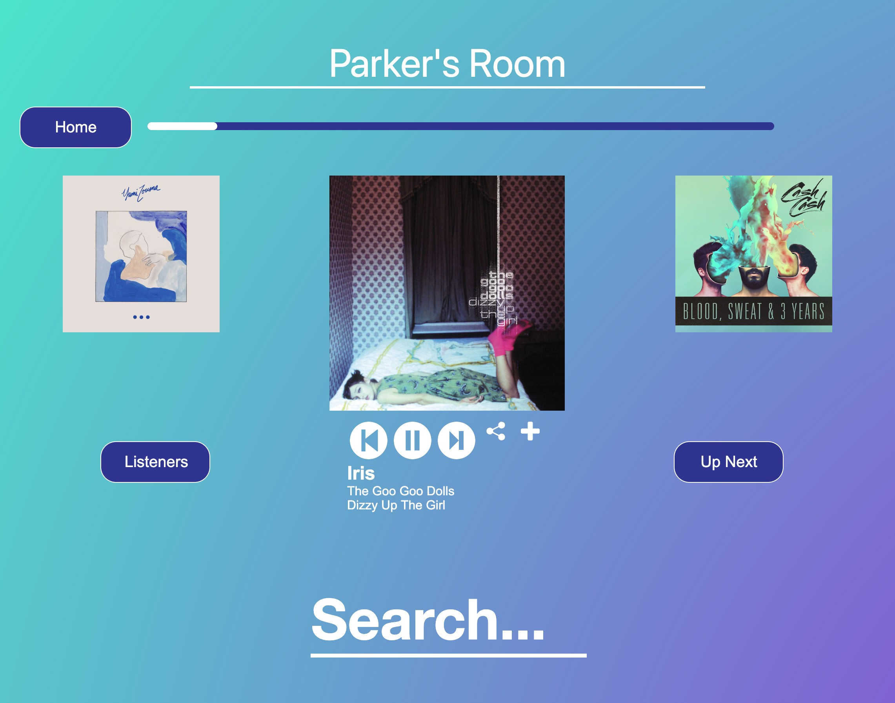

# Octave

Octave is a MERN stack application that allows users to listen to songs together.  It uses the Spotify Web API on the server side for authentication, and uses the Spotify Web Playback SDK for client-side playback in the browser.

Feel free to use the following information to log into Spotify to test out the application:
Username: testingspot78@gmail.com
Password: okThenOakLand48$$

## Pick a room

When a user logs in to the site, they are redirected to the room select screen and their most recent song played on Spotify will begin playing.  They are then presented with three options.

1. Create a new room.  This will create a new room object in the database, and continue playback of their currently playing song.  

2. Join a room.  The user can enter a room ID, which will search the database for a room with that room ID.  If the room is found, they will be redirected to the LiveStream screen, and if the room is not found, they will be presented with an error.

3. Join a current room from the Current Rooms list.  The currently playing rooms are presented in a list in the RoomSelect screen.  If the user clicks the join button by any currently playing room, they will be redirected to the live stream page for that room.

## Now Playing

Once the user is in the livestream page, they are in one of two roles.  If they created the room, they are the creator, and if they joined the room, they are a listener.  The only difference between the two is that the creator can play, pause, go to the previous song, and go to the next song.  

The creator and the listeners can add songs to a room. They have three different options for doing this.

1. They can search for a song in the bottom search bar and add the song to the queue.

2. They can search for an artist, and then add that artists top ten songs to the upcoming queue.  (More artist functionality will be coming soon, such as playing specific albums from an artist).

3. The user can search for a playlist either in their library or in Spotify, and then play that playlist.  This will replace all current songs in the queue and start playback of the playlist.

## Search your saved songs

Using the search bar, you can browse your saved songs, view your top artists, and search the entire Spotify catalog for songs, artists, and playlists.  Once you find content that you like, you can either click Play Now to play the selected song right after the current song ends, or click Play Later to add the selected song to the end of the queue to play later.

## Make your room public for everyone to see

If you do not want anyone to be able to view your room from the home screen, simply click the lock at the upper right hand of the screen to make your room either public or private.

## Save songs you like to your Spotify library

If you like the current song that you are listening to, click the plus button next to the song controls to add the current song to your library.

## Invite your friends!

Simply click the share button near the song controls to get the ID of your room.  You can then send the ID to your friends, and they will be able to join whether or not the room is public or private.

## Automatic creator switching

Anytime the creator leaves the room, if there are any other people in the room, they will be promoted to the creator.  The creator can toggle playback, as well as clear the upcoming queue.  Anyone can add songs to the queue.  Once there are no more people in a room, it is automatically deleted, so you know that any room you join will be active!

## Song Recommendations

If there are no more songs left in the queue once the last song in the room ends, the application will find a song based on the last five songs played in the room, and start playback of that song for all users in the room.

## Synchronization

All playback of users of the room is synchronized to that of the creator.  Any time the creator toggles playback or changes the current song, the listeners' playback will also be changed.

